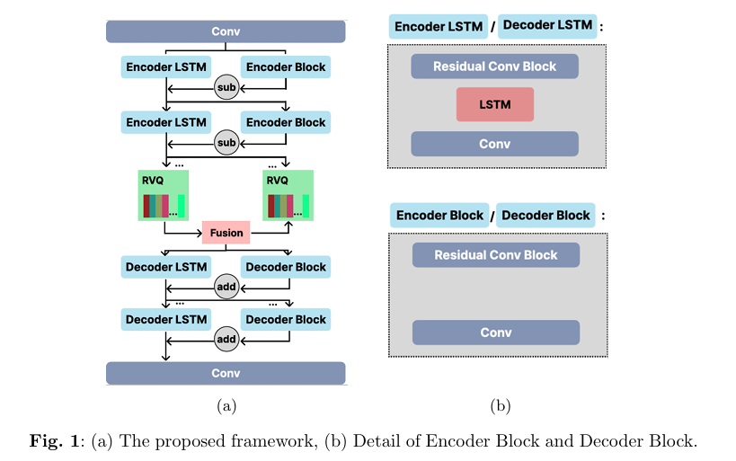

<div align="center">

# LSCodec
## A Time series long-short term codec for compression and representation
This repository supplements our paper "LSCodec: A Time series long-short term codec for compression and representation". 

</div>

## TODO
- [x] Implement of LSCodec model
- [x] Training scripts and configs
- [ ] Downstream task scripts
- [ ] Pre-trained checkpoints
- [ ] how to cite our paper

## Framework


## Environment Setup

Create and activate a virtual environment to work in, e.g. using env:

```sh
python -m venv your_env_lscodec 
your_env_lscodec/Scripts/activate  
```

Install CUDA and PyTorch 1.13. For CUDA 11.6, this would look like:

```sh
pip install torch==1.13.1+cu116 torchvision==0.14.1+cu116 torchaudio==0.13.1 --extra-index-url https://download.pytorch.org/whl/cu116
```
Install the remaining requirements with pip:

```sh
pip install -r requirements.txt
```
The proposed framework is high relied on [vector_quantize](https://github.com/lucidrains/vector-quantize-pytorch), it is an excellent VQ library.   


## Datasets
LSCodec supports Multi-Channel regular Time Series Sequences. For data preparing, we follow  [DTAAN](https://github.com/Yu-Lingrui/DTAAD) scripts for data normalization and train/valid splitting.
```sh
python ./preprocess.py <datasets>  
```
where <datasets> is space separated list of datasets like 'synthetic', 'SMD', 'SWaT', 'SMAP', 'MSL', 'WADI', 'MSDS', 'UCR', 'MBA', 'NAB' ...
The data should be placed in './data' folder. And the preprocessed data will be generated in './processed' folder. Considering that datasets is not allowed for distribution, 
we recommand to access dataset by its official website. 

## Training
For CPU training 
```sh
python ./train.v1.py --task lscodec --config ./config/config_lscodec_xxx.toml --force_cpu  
```

For single GPU training 
```sh
python ./train.v1.py --task lscodec --config ./config/config_lscodec_xxx.toml  
```

For Multi-GPU training, we build our training code upon [Accelerate](https://huggingface.co/docs/accelerate/index) for multi-gpu training, you need to prepare your gpu-env configurations.
```sh
CUDA_VISIBLE_DEVICES=xxxx accelerate launch --config_file ./your_accelerate_config  ./train.v1.py --task lscodec --config ./config/config_lscodec_xxx.toml    
```

## License
BSD-3-Clause.      
Copyright (c) 2024, Haiwei Zuo.      
All rights reserved.
See License file for more details.